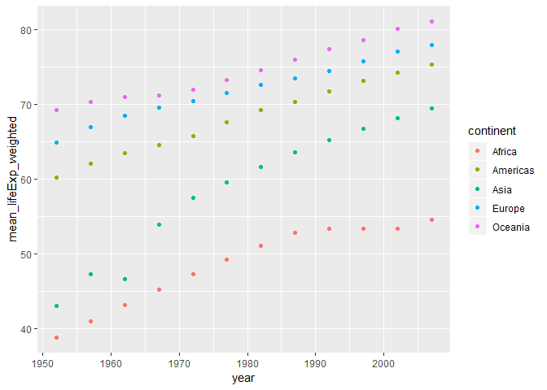
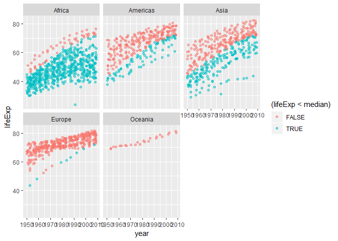
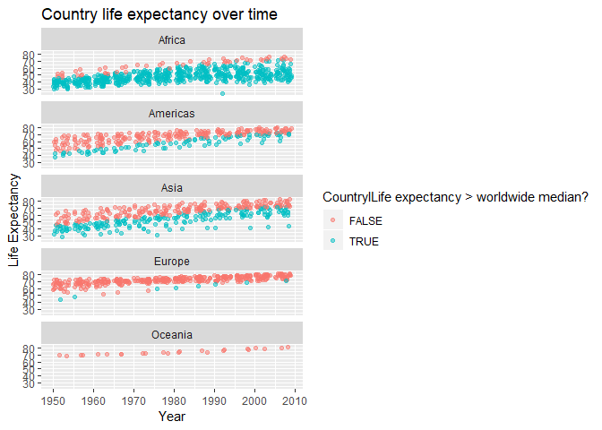

hw05-ntjjmak
================
Nicole Mak
15/10/2018

# Assignment \#5

**Load the packages to be used and load the singer data set.**

``` r
suppressPackageStartupMessages(library(dplyr))
suppressPackageStartupMessages(library(ggplot2))
suppressPackageStartupMessages(library(tidyverse))
suppressPackageStartupMessages(library(forcats))
suppressPackageStartupMessages(library(knitr))
suppressPackageStartupMessages(library(gapminder))
```

## Part 1: Factor management

**Factors are how categorical data are stored. The values a factor can
take on are called levels. It is important to check variable types. What
you think are characters may actually be stored numerically. Let’s
explore the data frame.**

``` r
summary(gapminder)
```

    ##         country        continent        year         lifeExp     
    ##  Afghanistan:  12   Africa  :624   Min.   :1952   Min.   :23.60  
    ##  Albania    :  12   Americas:300   1st Qu.:1966   1st Qu.:48.20  
    ##  Algeria    :  12   Asia    :396   Median :1980   Median :60.71  
    ##  Angola     :  12   Europe  :360   Mean   :1980   Mean   :59.47  
    ##  Argentina  :  12   Oceania : 24   3rd Qu.:1993   3rd Qu.:70.85  
    ##  Australia  :  12                  Max.   :2007   Max.   :82.60  
    ##  (Other)    :1632                                                
    ##       pop              gdpPercap       
    ##  Min.   :6.001e+04   Min.   :   241.2  
    ##  1st Qu.:2.794e+06   1st Qu.:  1202.1  
    ##  Median :7.024e+06   Median :  3531.8  
    ##  Mean   :2.960e+07   Mean   :  7215.3  
    ##  3rd Qu.:1.959e+07   3rd Qu.:  9325.5  
    ##  Max.   :1.319e+09   Max.   :113523.1  
    ## 

**Before beginning the factor management exercise, let’s get to know the
factors in the gapminder data set.**

``` r
class(gapminder$country)
```

    ## [1] "factor"

``` r
class(gapminder$continent)
```

    ## [1] "factor"

``` r
class(gapminder$year)
```

    ## [1] "integer"

``` r
class(gapminder$lifeExp)
```

    ## [1] "numeric"

``` r
class(gapminder$pop)
```

    ## [1] "integer"

``` r
class(gapminder$gdpPercap)
```

    ## [1] "numeric"

**We see that we have two factors in this data set. Let’s see the levels
for “country” and “continent” before we begin filtering the data.**

``` r
nlevels(gapminder$country)
```

    ## [1] 142

``` r
nlevels(gapminder$continent)
```

    ## [1] 5

``` r
levels(gapminder$country)
```

    ##   [1] "Afghanistan"              "Albania"                 
    ##   [3] "Algeria"                  "Angola"                  
    ##   [5] "Argentina"                "Australia"               
    ##   [7] "Austria"                  "Bahrain"                 
    ##   [9] "Bangladesh"               "Belgium"                 
    ##  [11] "Benin"                    "Bolivia"                 
    ##  [13] "Bosnia and Herzegovina"   "Botswana"                
    ##  [15] "Brazil"                   "Bulgaria"                
    ##  [17] "Burkina Faso"             "Burundi"                 
    ##  [19] "Cambodia"                 "Cameroon"                
    ##  [21] "Canada"                   "Central African Republic"
    ##  [23] "Chad"                     "Chile"                   
    ##  [25] "China"                    "Colombia"                
    ##  [27] "Comoros"                  "Congo, Dem. Rep."        
    ##  [29] "Congo, Rep."              "Costa Rica"              
    ##  [31] "Cote d'Ivoire"            "Croatia"                 
    ##  [33] "Cuba"                     "Czech Republic"          
    ##  [35] "Denmark"                  "Djibouti"                
    ##  [37] "Dominican Republic"       "Ecuador"                 
    ##  [39] "Egypt"                    "El Salvador"             
    ##  [41] "Equatorial Guinea"        "Eritrea"                 
    ##  [43] "Ethiopia"                 "Finland"                 
    ##  [45] "France"                   "Gabon"                   
    ##  [47] "Gambia"                   "Germany"                 
    ##  [49] "Ghana"                    "Greece"                  
    ##  [51] "Guatemala"                "Guinea"                  
    ##  [53] "Guinea-Bissau"            "Haiti"                   
    ##  [55] "Honduras"                 "Hong Kong, China"        
    ##  [57] "Hungary"                  "Iceland"                 
    ##  [59] "India"                    "Indonesia"               
    ##  [61] "Iran"                     "Iraq"                    
    ##  [63] "Ireland"                  "Israel"                  
    ##  [65] "Italy"                    "Jamaica"                 
    ##  [67] "Japan"                    "Jordan"                  
    ##  [69] "Kenya"                    "Korea, Dem. Rep."        
    ##  [71] "Korea, Rep."              "Kuwait"                  
    ##  [73] "Lebanon"                  "Lesotho"                 
    ##  [75] "Liberia"                  "Libya"                   
    ##  [77] "Madagascar"               "Malawi"                  
    ##  [79] "Malaysia"                 "Mali"                    
    ##  [81] "Mauritania"               "Mauritius"               
    ##  [83] "Mexico"                   "Mongolia"                
    ##  [85] "Montenegro"               "Morocco"                 
    ##  [87] "Mozambique"               "Myanmar"                 
    ##  [89] "Namibia"                  "Nepal"                   
    ##  [91] "Netherlands"              "New Zealand"             
    ##  [93] "Nicaragua"                "Niger"                   
    ##  [95] "Nigeria"                  "Norway"                  
    ##  [97] "Oman"                     "Pakistan"                
    ##  [99] "Panama"                   "Paraguay"                
    ## [101] "Peru"                     "Philippines"             
    ## [103] "Poland"                   "Portugal"                
    ## [105] "Puerto Rico"              "Reunion"                 
    ## [107] "Romania"                  "Rwanda"                  
    ## [109] "Sao Tome and Principe"    "Saudi Arabia"            
    ## [111] "Senegal"                  "Serbia"                  
    ## [113] "Sierra Leone"             "Singapore"               
    ## [115] "Slovak Republic"          "Slovenia"                
    ## [117] "Somalia"                  "South Africa"            
    ## [119] "Spain"                    "Sri Lanka"               
    ## [121] "Sudan"                    "Swaziland"               
    ## [123] "Sweden"                   "Switzerland"             
    ## [125] "Syria"                    "Taiwan"                  
    ## [127] "Tanzania"                 "Thailand"                
    ## [129] "Togo"                     "Trinidad and Tobago"     
    ## [131] "Tunisia"                  "Turkey"                  
    ## [133] "Uganda"                   "United Kingdom"          
    ## [135] "United States"            "Uruguay"                 
    ## [137] "Venezuela"                "Vietnam"                 
    ## [139] "West Bank and Gaza"       "Yemen, Rep."             
    ## [141] "Zambia"                   "Zimbabwe"

``` r
levels(gapminder$continent)
```

    ## [1] "Africa"   "Americas" "Asia"     "Europe"   "Oceania"

**Now let’s work towards dropping “Oceoania”.**

**We will start by filtering the gapminder data to remove observations
associated with the continent of Oceania.**

``` r
No_Oceania <- gapminder %>%
  filter(continent == "Africa" | continent =="Americas"|continent == "Asia"|continent == "Europe")
No_Oceania %>% 
  sample_frac(0.1) %>% #just showing a sample of the data
  knitr:: kable(format = "markdown", justify = "centre")
```

| country                | continent | year | lifeExp |        pop |  gdpPercap |
| :--------------------- | :-------- | ---: | ------: | ---------: | ---------: |
| Sri Lanka              | Asia      | 1992 |  70.379 |   17587060 |  2153.7392 |
| Lebanon                | Asia      | 1952 |  55.928 |    1439529 |  4834.8041 |
| Brazil                 | Americas  | 1982 |  63.336 |  128962939 |  7030.8359 |
| Equatorial Guinea      | Africa    | 1977 |  42.024 |     192675 |   958.5668 |
| Uganda                 | Africa    | 1952 |  39.978 |    5824797 |   734.7535 |
| Haiti                  | Americas  | 1962 |  43.590 |    3880130 |  1796.5890 |
| Madagascar             | Africa    | 2007 |  59.443 |   19167654 |  1044.7701 |
| Croatia                | Europe    | 1962 |  67.130 |    4076557 |  5477.8900 |
| Korea, Rep.            | Asia      | 1967 |  57.716 |   30131000 |  2029.2281 |
| Trinidad and Tobago    | Americas  | 2007 |  69.819 |    1056608 | 18008.5092 |
| Oman                   | Asia      | 1997 |  72.499 |    2283635 | 19702.0558 |
| Ecuador                | Americas  | 1957 |  51.356 |    4058385 |  3780.5467 |
| Canada                 | Americas  | 1997 |  78.610 |   30305843 | 28954.9259 |
| Cameroon               | Africa    | 1962 |  42.643 |    5793633 |  1399.6074 |
| Philippines            | Asia      | 1952 |  47.752 |   22438691 |  1272.8810 |
| Bulgaria               | Europe    | 1962 |  69.510 |    8012946 |  4254.3378 |
| Pakistan               | Asia      | 2002 |  63.610 |  153403524 |  2092.7124 |
| Philippines            | Asia      | 2002 |  70.303 |   82995088 |  2650.9211 |
| Finland                | Europe    | 1997 |  77.130 |    5134406 | 23723.9502 |
| Ethiopia               | Africa    | 1967 |  42.115 |   27860297 |   516.1186 |
| West Bank and Gaza     | Asia      | 1997 |  71.096 |    2826046 |  7110.6676 |
| Botswana               | Africa    | 1987 |  63.622 |    1151184 |  6205.8839 |
| Norway                 | Europe    | 1987 |  75.890 |    4186147 | 31540.9748 |
| Guinea                 | Africa    | 1992 |  48.576 |    6990574 |   794.3484 |
| Guinea-Bissau          | Africa    | 1977 |  37.465 |     745228 |   764.7260 |
| Sweden                 | Europe    | 1992 |  78.160 |    8718867 | 23880.0168 |
| Rwanda                 | Africa    | 1962 |  43.000 |    3051242 |   597.4731 |
| Turkey                 | Europe    | 1987 |  63.108 |   52881328 |  5089.0437 |
| Congo, Dem. Rep.       | Africa    | 1962 |  42.122 |   17486434 |   896.3146 |
| Indonesia              | Asia      | 1987 |  60.137 |  169276000 |  1748.3570 |
| Finland                | Europe    | 1977 |  72.520 |    4738902 | 15605.4228 |
| Uganda                 | Africa    | 1992 |  48.825 |   18252190 |   644.1708 |
| Ireland                | Europe    | 1987 |  74.360 |    3539900 | 13872.8665 |
| Tunisia                | Africa    | 1997 |  71.973 |    9231669 |  4876.7986 |
| Togo                   | Africa    | 1972 |  49.759 |    2056351 |  1649.6602 |
| Germany                | Europe    | 1997 |  77.340 |   82011073 | 27788.8842 |
| Uganda                 | Africa    | 1987 |  51.509 |   15283050 |   617.7244 |
| Congo, Rep.            | Africa    | 1972 |  54.907 |    1340458 |  3213.1527 |
| Equatorial Guinea      | Africa    | 2002 |  49.348 |     495627 |  7703.4959 |
| Mongolia               | Asia      | 1952 |  42.244 |     800663 |   786.5669 |
| Thailand               | Asia      | 1957 |  53.630 |   25041917 |   793.5774 |
| Singapore              | Asia      | 1977 |  70.795 |    2325300 | 11210.0895 |
| France                 | Europe    | 2007 |  80.657 |   61083916 | 30470.0167 |
| Morocco                | Africa    | 1952 |  42.873 |    9939217 |  1688.2036 |
| Gambia                 | Africa    | 1972 |  38.308 |     517101 |   756.0868 |
| Syria                  | Asia      | 1962 |  50.305 |    4834621 |  2193.0371 |
| El Salvador            | Americas  | 1997 |  69.535 |    5783439 |  5154.8255 |
| South Africa           | Africa    | 1982 |  58.161 |   31140029 |  8568.2662 |
| Peru                   | Americas  | 1967 |  51.445 |   12132200 |  5788.0933 |
| Israel                 | Asia      | 1987 |  75.600 |    4203148 | 17122.4799 |
| Bosnia and Herzegovina | Europe    | 1967 |  64.790 |    3585000 |  2172.3524 |
| Angola                 | Africa    | 1972 |  37.928 |    5894858 |  5473.2880 |
| Mexico                 | Americas  | 1952 |  50.789 |   30144317 |  3478.1255 |
| El Salvador            | Americas  | 1977 |  56.696 |    4282586 |  5138.9224 |
| Sudan                  | Africa    | 1967 |  42.858 |   12716129 |  1687.9976 |
| Honduras               | Americas  | 1957 |  44.665 |    1770390 |  2220.4877 |
| Portugal               | Europe    | 2007 |  78.098 |   10642836 | 20509.6478 |
| Haiti                  | Americas  | 1957 |  40.696 |    3507701 |  1726.8879 |
| Bangladesh             | Asia      | 2002 |  62.013 |  135656790 |  1136.3904 |
| Serbia                 | Europe    | 1977 |  70.300 |    8686367 | 12980.6696 |
| Argentina              | Americas  | 1972 |  67.065 |   24779799 |  9443.0385 |
| Sudan                  | Africa    | 1952 |  38.635 |    8504667 |  1615.9911 |
| Pakistan               | Asia      | 1967 |  49.800 |   60641899 |   942.4083 |
| Jamaica                | Americas  | 2007 |  72.567 |    2780132 |  7320.8803 |
| Bahrain                | Asia      | 1962 |  56.923 |     171863 | 12753.2751 |
| Guinea-Bissau          | Africa    | 1957 |  33.489 |     601095 |   431.7905 |
| Senegal                | Africa    | 1972 |  45.815 |    4588696 |  1597.7121 |
| Mali                   | Africa    | 1977 |  41.714 |    6491649 |   686.3953 |
| Dominican Republic     | Americas  | 1992 |  68.457 |    7351181 |  3044.2142 |
| Botswana               | Africa    | 1997 |  52.556 |    1536536 |  8647.1423 |
| Libya                  | Africa    | 1977 |  57.442 |    2721783 | 21951.2118 |
| Burkina Faso           | Africa    | 1977 |  46.137 |    5889574 |   743.3870 |
| Cambodia               | Asia      | 1952 |  39.417 |    4693836 |   368.4693 |
| Egypt                  | Africa    | 2002 |  69.806 |   73312559 |  4754.6044 |
| Indonesia              | Asia      | 1972 |  49.203 |  121282000 |  1111.1079 |
| Somalia                | Africa    | 1957 |  34.977 |    2780415 |  1258.1474 |
| Haiti                  | Americas  | 1987 |  53.636 |    5756203 |  1823.0160 |
| Peru                   | Americas  | 1952 |  43.902 |    8025700 |  3758.5234 |
| Philippines            | Asia      | 1957 |  51.334 |   26072194 |  1547.9448 |
| Lebanon                | Asia      | 1962 |  62.094 |    1886848 |  5714.5606 |
| Burundi                | Africa    | 1992 |  44.736 |    5809236 |   631.6999 |
| Burkina Faso           | Africa    | 1962 |  37.814 |    4919632 |   722.5120 |
| Guatemala              | Americas  | 1962 |  46.954 |    4208858 |  2750.3644 |
| Canada                 | Americas  | 1952 |  68.750 |   14785584 | 11367.1611 |
| Afghanistan            | Asia      | 1987 |  40.822 |   13867957 |   852.3959 |
| Venezuela              | Americas  | 1977 |  67.456 |   13503563 | 13143.9510 |
| Slovak Republic        | Europe    | 1967 |  70.980 |    4442238 |  8412.9024 |
| Libya                  | Africa    | 1972 |  52.773 |    2183877 | 21011.4972 |
| Chile                  | Americas  | 1972 |  63.441 |    9717524 |  5494.0244 |
| Venezuela              | Americas  | 1992 |  71.150 |   20265563 | 10733.9263 |
| Zimbabwe               | Africa    | 2007 |  43.487 |   12311143 |   469.7093 |
| Paraguay               | Americas  | 2002 |  70.755 |    5884491 |  3783.6742 |
| Finland                | Europe    | 1952 |  66.550 |    4090500 |  6424.5191 |
| Montenegro             | Europe    | 2007 |  74.543 |     684736 |  9253.8961 |
| Sierra Leone           | Africa    | 1992 |  38.333 |    4260884 |  1068.6963 |
| Eritrea                | Africa    | 1997 |  53.378 |    4058319 |   913.4708 |
| India                  | Asia      | 2007 |  64.698 | 1110396331 |  2452.2104 |
| Madagascar             | Africa    | 1967 |  42.881 |    6334556 |  1634.0473 |
| Brazil                 | Americas  | 1962 |  55.665 |   76039390 |  3336.5858 |
| Gambia                 | Africa    | 1962 |  33.896 |     374020 |   599.6503 |
| Syria                  | Asia      | 2007 |  74.143 |   19314747 |  4184.5481 |
| Kuwait                 | Asia      | 2002 |  76.904 |    2111561 | 35110.1057 |
| Rwanda                 | Africa    | 2007 |  46.242 |    8860588 |   863.0885 |
| Philippines            | Asia      | 1992 |  66.458 |   67185766 |  2279.3240 |
| Niger                  | Africa    | 1957 |  38.598 |    3692184 |   835.5234 |
| Mauritania             | Africa    | 1987 |  56.145 |    1841240 |  1421.6036 |
| Venezuela              | Americas  | 1972 |  65.712 |   11515649 | 10505.2597 |
| Portugal               | Europe    | 1952 |  59.820 |    8526050 |  3068.3199 |
| Mali                   | Africa    | 1962 |  36.936 |    4690372 |   496.1743 |
| Finland                | Europe    | 1972 |  70.870 |    4639657 | 14358.8759 |
| Czech Republic         | Europe    | 1982 |  70.960 |   10303704 | 15377.2285 |
| Bosnia and Herzegovina | Europe    | 1977 |  69.860 |    4086000 |  3528.4813 |
| Iceland                | Europe    | 1997 |  78.950 |     271192 | 28061.0997 |
| Turkey                 | Europe    | 1962 |  52.098 |   29788695 |  2322.8699 |
| France                 | Europe    | 1982 |  74.890 |   54433565 | 20293.8975 |
| Austria                | Europe    | 1957 |  67.480 |    6965860 |  8842.5980 |
| South Africa           | Africa    | 1972 |  53.696 |   23935810 |  7765.9626 |
| Namibia                | Africa    | 1962 |  48.386 |     621392 |  3173.2156 |
| Bolivia                | Americas  | 1977 |  50.023 |    5079716 |  3548.0978 |
| Guatemala              | Americas  | 1987 |  60.782 |    7326406 |  4246.4860 |
| Swaziland              | Africa    | 1967 |  46.633 |     420690 |  2613.1017 |
| Trinidad and Tobago    | Americas  | 1952 |  59.100 |     662850 |  3023.2719 |
| Belgium                | Europe    | 1987 |  75.350 |    9870200 | 22525.5631 |
| Vietnam                | Asia      | 1972 |  50.254 |   44655014 |   699.5016 |
| Kuwait                 | Asia      | 1967 |  64.624 |     575003 | 80894.8833 |
| Haiti                  | Americas  | 2007 |  60.916 |    8502814 |  1201.6372 |
| Zimbabwe               | Africa    | 1962 |  52.358 |    4277736 |   527.2722 |
| West Bank and Gaza     | Asia      | 1957 |  45.671 |    1070439 |  1827.0677 |
| Syria                  | Asia      | 1987 |  66.974 |   11242847 |  3116.7743 |
| Ireland                | Europe    | 1992 |  75.467 |    3557761 | 17558.8155 |
| Saudi Arabia           | Asia      | 1957 |  42.868 |    4419650 |  8157.5912 |
| Eritrea                | Africa    | 1967 |  42.189 |    1820319 |   468.7950 |
| El Salvador            | Americas  | 1957 |  48.570 |    2355805 |  3421.5232 |
| Canada                 | Americas  | 1992 |  77.950 |   28523502 | 26342.8843 |
| United Kingdom         | Europe    | 1957 |  70.420 |   51430000 | 11283.1779 |
| Kenya                  | Africa    | 1962 |  47.949 |    8678557 |   896.9664 |
| Israel                 | Asia      | 1977 |  73.060 |    3495918 | 13306.6192 |
| Mauritania             | Africa    | 2002 |  62.247 |    2828858 |  1579.0195 |
| Denmark                | Europe    | 1962 |  72.350 |    4646899 | 13583.3135 |
| Japan                  | Asia      | 1972 |  73.420 |  107188273 | 14778.7864 |
| Comoros                | Africa    | 2002 |  62.974 |     614382 |  1075.8116 |
| Lesotho                | Africa    | 1987 |  57.180 |    1599200 |   773.9932 |
| Thailand               | Asia      | 1962 |  56.061 |   29263397 |  1002.1992 |
| Korea, Dem. Rep.       | Asia      | 1952 |  50.056 |    8865488 |  1088.2778 |
| Poland                 | Europe    | 1967 |  69.610 |   31785378 |  6557.1528 |
| Sudan                  | Africa    | 1972 |  45.083 |   14597019 |  1659.6528 |
| Germany                | Europe    | 2007 |  79.406 |   82400996 | 32170.3744 |
| Angola                 | Africa    | 1987 |  39.906 |    7874230 |  2430.2083 |
| Sierra Leone           | Africa    | 1977 |  36.788 |    3140897 |  1348.2852 |
| Serbia                 | Europe    | 1987 |  71.218 |    9230783 | 15870.8785 |
| Slovenia               | Europe    | 1962 |  69.150 |    1582962 |  7402.3034 |
| Nigeria                | Africa    | 1962 |  39.360 |   41871351 |  1150.9275 |
| Singapore              | Asia      | 2002 |  78.770 |    4197776 | 36023.1054 |
| Bahrain                | Asia      | 1997 |  73.925 |     598561 | 20292.0168 |
| Ethiopia               | Africa    | 1997 |  49.402 |   59861301 |   515.8894 |
| Sudan                  | Africa    | 1957 |  39.624 |    9753392 |  1770.3371 |
| Somalia                | Africa    | 1952 |  32.978 |    2526994 |  1135.7498 |
| Bosnia and Herzegovina | Europe    | 2007 |  74.852 |    4552198 |  7446.2988 |
| Israel                 | Asia      | 1982 |  74.450 |    3858421 | 15367.0292 |
| Romania                | Europe    | 1967 |  66.800 |   19284814 |  6470.8665 |
| West Bank and Gaza     | Asia      | 1977 |  60.765 |    1261091 |  3682.8315 |
| Iraq                   | Asia      | 1957 |  48.437 |    6248643 |  6229.3336 |
| Myanmar                | Asia      | 1982 |  58.056 |   34680442 |   424.0000 |
| Sudan                  | Africa    | 1992 |  53.556 |   28227588 |  1492.1970 |
| Nigeria                | Africa    | 1997 |  47.464 |  106207839 |  1624.9413 |
| Senegal                | Africa    | 2007 |  63.062 |   12267493 |  1712.4721 |
| Togo                   | Africa    | 2002 |  57.561 |    4977378 |   886.2206 |
| Lebanon                | Asia      | 2002 |  71.028 |    3677780 |  9313.9388 |

**Let’s check how many levels there are and whether we need to remove
unused factor levels.**

``` r
nlevels(No_Oceania$continent)
```

    ## [1] 5

``` r
levels(No_Oceania$continent)
```

    ## [1] "Africa"   "Americas" "Asia"     "Europe"   "Oceania"

**We see that there are still 5 levels. Let’s remove the unused factor
levels.**

``` r
Drop_Oceania <- No_Oceania %>% 
  droplevels()
nlevels(Drop_Oceania$continent)
```

    ## [1] 4

``` r
levels(Drop_Oceania$continent)
```

    ## [1] "Africa"   "Americas" "Asia"     "Europe"

**We do note that the factor levels are ordered alphabetically. Let’s
use forcats to re-order the factor levels. We can re-order in different
ways.**

**One way to re-order is by frequency.For example, the frequency of
continents in the data.**

``` r
Drop_Oceania$continent %>% 
  fct_infreq() %>% 
  levels()
```

    ## [1] "Africa"   "Asia"     "Europe"   "Americas"

**We can also re-order by the value of other variables in the data as
life expectanc or gdp.**

``` r
Drop_Oceania_1980 <- Drop_Oceania %>% 
  filter(year > 1979) %>% 
  group_by(continent, year) %>% 
  mutate(mediangdp = median(gdpPercap))

Drop_Oceania_1980
```

    ## # A tibble: 840 x 7
    ## # Groups:   continent, year [24]
    ##    country     continent  year lifeExp      pop gdpPercap mediangdp
    ##    <fct>       <fct>     <int>   <dbl>    <int>     <dbl>     <dbl>
    ##  1 Afghanistan Asia       1982    39.9 12881816      978.     4107.
    ##  2 Afghanistan Asia       1987    40.8 13867957      852.     4106.
    ##  3 Afghanistan Asia       1992    41.7 16317921      649.     3726.
    ##  4 Afghanistan Asia       1997    41.8 22227415      635.     3645.
    ##  5 Afghanistan Asia       2002    42.1 25268405      727.     4091.
    ##  6 Afghanistan Asia       2007    43.8 31889923      975.     4471.
    ##  7 Albania     Europe     1982    70.4  2780097     3631.    15323.
    ##  8 Albania     Europe     1987    72    3075321     3739.    16215.
    ##  9 Albania     Europe     1992    71.6  3326498     2497.    17550.
    ## 10 Albania     Europe     1997    73.0  3428038     3193.    19596.
    ## # ... with 830 more rows

``` r
fct_reorder(Drop_Oceania_1980$continent, Drop_Oceania_1980$gdpPercap, min) %>% 
  levels() %>% head()
```

    ## [1] "Africa"   "Asia"     "Americas" "Europe"

**Now we can put this into graph
form.**

``` r
ggplot(Drop_Oceania_1980, aes(x = year, y = Drop_Oceania_1980$mediangdp, color = fct_reorder2(continent, year, Drop_Oceania_1980$mediangdp))) +
  geom_line() +
  labs(color = "Continent")+
  xlab("Year") + ylab("Median GDP") +
  ggtitle("Median GDP 1980-2007 by Continent")
```

<!-- -->

**We see that reordering the levels allows the legend to be organized in
the same fashion as the trendlines.**

## Part 2 File input and output

**Let’s try saving some wrangled data into a new file.**

``` r
trial<- gapminder %>%
  filter(year == "2007")

write.csv(trial, file = "assignment5_stat545")
```

**Now let’s import this file to see if we can read
    it.**

``` r
read.csv("assignment5_stat545")
```

    ##       X                  country continent year lifeExp        pop
    ## 1     1              Afghanistan      Asia 2007  43.828   31889923
    ## 2     2                  Albania    Europe 2007  76.423    3600523
    ## 3     3                  Algeria    Africa 2007  72.301   33333216
    ## 4     4                   Angola    Africa 2007  42.731   12420476
    ## 5     5                Argentina  Americas 2007  75.320   40301927
    ## 6     6                Australia   Oceania 2007  81.235   20434176
    ## 7     7                  Austria    Europe 2007  79.829    8199783
    ## 8     8                  Bahrain      Asia 2007  75.635     708573
    ## 9     9               Bangladesh      Asia 2007  64.062  150448339
    ## 10   10                  Belgium    Europe 2007  79.441   10392226
    ## 11   11                    Benin    Africa 2007  56.728    8078314
    ## 12   12                  Bolivia  Americas 2007  65.554    9119152
    ## 13   13   Bosnia and Herzegovina    Europe 2007  74.852    4552198
    ## 14   14                 Botswana    Africa 2007  50.728    1639131
    ## 15   15                   Brazil  Americas 2007  72.390  190010647
    ## 16   16                 Bulgaria    Europe 2007  73.005    7322858
    ## 17   17             Burkina Faso    Africa 2007  52.295   14326203
    ## 18   18                  Burundi    Africa 2007  49.580    8390505
    ## 19   19                 Cambodia      Asia 2007  59.723   14131858
    ## 20   20                 Cameroon    Africa 2007  50.430   17696293
    ## 21   21                   Canada  Americas 2007  80.653   33390141
    ## 22   22 Central African Republic    Africa 2007  44.741    4369038
    ## 23   23                     Chad    Africa 2007  50.651   10238807
    ## 24   24                    Chile  Americas 2007  78.553   16284741
    ## 25   25                    China      Asia 2007  72.961 1318683096
    ## 26   26                 Colombia  Americas 2007  72.889   44227550
    ## 27   27                  Comoros    Africa 2007  65.152     710960
    ## 28   28         Congo, Dem. Rep.    Africa 2007  46.462   64606759
    ## 29   29              Congo, Rep.    Africa 2007  55.322    3800610
    ## 30   30               Costa Rica  Americas 2007  78.782    4133884
    ## 31   31            Cote d'Ivoire    Africa 2007  48.328   18013409
    ## 32   32                  Croatia    Europe 2007  75.748    4493312
    ## 33   33                     Cuba  Americas 2007  78.273   11416987
    ## 34   34           Czech Republic    Europe 2007  76.486   10228744
    ## 35   35                  Denmark    Europe 2007  78.332    5468120
    ## 36   36                 Djibouti    Africa 2007  54.791     496374
    ## 37   37       Dominican Republic  Americas 2007  72.235    9319622
    ## 38   38                  Ecuador  Americas 2007  74.994   13755680
    ## 39   39                    Egypt    Africa 2007  71.338   80264543
    ## 40   40              El Salvador  Americas 2007  71.878    6939688
    ## 41   41        Equatorial Guinea    Africa 2007  51.579     551201
    ## 42   42                  Eritrea    Africa 2007  58.040    4906585
    ## 43   43                 Ethiopia    Africa 2007  52.947   76511887
    ## 44   44                  Finland    Europe 2007  79.313    5238460
    ## 45   45                   France    Europe 2007  80.657   61083916
    ## 46   46                    Gabon    Africa 2007  56.735    1454867
    ## 47   47                   Gambia    Africa 2007  59.448    1688359
    ## 48   48                  Germany    Europe 2007  79.406   82400996
    ## 49   49                    Ghana    Africa 2007  60.022   22873338
    ## 50   50                   Greece    Europe 2007  79.483   10706290
    ## 51   51                Guatemala  Americas 2007  70.259   12572928
    ## 52   52                   Guinea    Africa 2007  56.007    9947814
    ## 53   53            Guinea-Bissau    Africa 2007  46.388    1472041
    ## 54   54                    Haiti  Americas 2007  60.916    8502814
    ## 55   55                 Honduras  Americas 2007  70.198    7483763
    ## 56   56         Hong Kong, China      Asia 2007  82.208    6980412
    ## 57   57                  Hungary    Europe 2007  73.338    9956108
    ## 58   58                  Iceland    Europe 2007  81.757     301931
    ## 59   59                    India      Asia 2007  64.698 1110396331
    ## 60   60                Indonesia      Asia 2007  70.650  223547000
    ## 61   61                     Iran      Asia 2007  70.964   69453570
    ## 62   62                     Iraq      Asia 2007  59.545   27499638
    ## 63   63                  Ireland    Europe 2007  78.885    4109086
    ## 64   64                   Israel      Asia 2007  80.745    6426679
    ## 65   65                    Italy    Europe 2007  80.546   58147733
    ## 66   66                  Jamaica  Americas 2007  72.567    2780132
    ## 67   67                    Japan      Asia 2007  82.603  127467972
    ## 68   68                   Jordan      Asia 2007  72.535    6053193
    ## 69   69                    Kenya    Africa 2007  54.110   35610177
    ## 70   70         Korea, Dem. Rep.      Asia 2007  67.297   23301725
    ## 71   71              Korea, Rep.      Asia 2007  78.623   49044790
    ## 72   72                   Kuwait      Asia 2007  77.588    2505559
    ## 73   73                  Lebanon      Asia 2007  71.993    3921278
    ## 74   74                  Lesotho    Africa 2007  42.592    2012649
    ## 75   75                  Liberia    Africa 2007  45.678    3193942
    ## 76   76                    Libya    Africa 2007  73.952    6036914
    ## 77   77               Madagascar    Africa 2007  59.443   19167654
    ## 78   78                   Malawi    Africa 2007  48.303   13327079
    ## 79   79                 Malaysia      Asia 2007  74.241   24821286
    ## 80   80                     Mali    Africa 2007  54.467   12031795
    ## 81   81               Mauritania    Africa 2007  64.164    3270065
    ## 82   82                Mauritius    Africa 2007  72.801    1250882
    ## 83   83                   Mexico  Americas 2007  76.195  108700891
    ## 84   84                 Mongolia      Asia 2007  66.803    2874127
    ## 85   85               Montenegro    Europe 2007  74.543     684736
    ## 86   86                  Morocco    Africa 2007  71.164   33757175
    ## 87   87               Mozambique    Africa 2007  42.082   19951656
    ## 88   88                  Myanmar      Asia 2007  62.069   47761980
    ## 89   89                  Namibia    Africa 2007  52.906    2055080
    ## 90   90                    Nepal      Asia 2007  63.785   28901790
    ## 91   91              Netherlands    Europe 2007  79.762   16570613
    ## 92   92              New Zealand   Oceania 2007  80.204    4115771
    ## 93   93                Nicaragua  Americas 2007  72.899    5675356
    ## 94   94                    Niger    Africa 2007  56.867   12894865
    ## 95   95                  Nigeria    Africa 2007  46.859  135031164
    ## 96   96                   Norway    Europe 2007  80.196    4627926
    ## 97   97                     Oman      Asia 2007  75.640    3204897
    ## 98   98                 Pakistan      Asia 2007  65.483  169270617
    ## 99   99                   Panama  Americas 2007  75.537    3242173
    ## 100 100                 Paraguay  Americas 2007  71.752    6667147
    ## 101 101                     Peru  Americas 2007  71.421   28674757
    ## 102 102              Philippines      Asia 2007  71.688   91077287
    ## 103 103                   Poland    Europe 2007  75.563   38518241
    ## 104 104                 Portugal    Europe 2007  78.098   10642836
    ## 105 105              Puerto Rico  Americas 2007  78.746    3942491
    ## 106 106                  Reunion    Africa 2007  76.442     798094
    ## 107 107                  Romania    Europe 2007  72.476   22276056
    ## 108 108                   Rwanda    Africa 2007  46.242    8860588
    ## 109 109    Sao Tome and Principe    Africa 2007  65.528     199579
    ## 110 110             Saudi Arabia      Asia 2007  72.777   27601038
    ## 111 111                  Senegal    Africa 2007  63.062   12267493
    ## 112 112                   Serbia    Europe 2007  74.002   10150265
    ## 113 113             Sierra Leone    Africa 2007  42.568    6144562
    ## 114 114                Singapore      Asia 2007  79.972    4553009
    ## 115 115          Slovak Republic    Europe 2007  74.663    5447502
    ## 116 116                 Slovenia    Europe 2007  77.926    2009245
    ## 117 117                  Somalia    Africa 2007  48.159    9118773
    ## 118 118             South Africa    Africa 2007  49.339   43997828
    ## 119 119                    Spain    Europe 2007  80.941   40448191
    ## 120 120                Sri Lanka      Asia 2007  72.396   20378239
    ## 121 121                    Sudan    Africa 2007  58.556   42292929
    ## 122 122                Swaziland    Africa 2007  39.613    1133066
    ## 123 123                   Sweden    Europe 2007  80.884    9031088
    ## 124 124              Switzerland    Europe 2007  81.701    7554661
    ## 125 125                    Syria      Asia 2007  74.143   19314747
    ## 126 126                   Taiwan      Asia 2007  78.400   23174294
    ## 127 127                 Tanzania    Africa 2007  52.517   38139640
    ## 128 128                 Thailand      Asia 2007  70.616   65068149
    ## 129 129                     Togo    Africa 2007  58.420    5701579
    ## 130 130      Trinidad and Tobago  Americas 2007  69.819    1056608
    ## 131 131                  Tunisia    Africa 2007  73.923   10276158
    ## 132 132                   Turkey    Europe 2007  71.777   71158647
    ## 133 133                   Uganda    Africa 2007  51.542   29170398
    ## 134 134           United Kingdom    Europe 2007  79.425   60776238
    ## 135 135            United States  Americas 2007  78.242  301139947
    ## 136 136                  Uruguay  Americas 2007  76.384    3447496
    ## 137 137                Venezuela  Americas 2007  73.747   26084662
    ## 138 138                  Vietnam      Asia 2007  74.249   85262356
    ## 139 139       West Bank and Gaza      Asia 2007  73.422    4018332
    ## 140 140              Yemen, Rep.      Asia 2007  62.698   22211743
    ## 141 141                   Zambia    Africa 2007  42.384   11746035
    ## 142 142                 Zimbabwe    Africa 2007  43.487   12311143
    ##      gdpPercap
    ## 1     974.5803
    ## 2    5937.0295
    ## 3    6223.3675
    ## 4    4797.2313
    ## 5   12779.3796
    ## 6   34435.3674
    ## 7   36126.4927
    ## 8   29796.0483
    ## 9    1391.2538
    ## 10  33692.6051
    ## 11   1441.2849
    ## 12   3822.1371
    ## 13   7446.2988
    ## 14  12569.8518
    ## 15   9065.8008
    ## 16  10680.7928
    ## 17   1217.0330
    ## 18    430.0707
    ## 19   1713.7787
    ## 20   2042.0952
    ## 21  36319.2350
    ## 22    706.0165
    ## 23   1704.0637
    ## 24  13171.6388
    ## 25   4959.1149
    ## 26   7006.5804
    ## 27    986.1479
    ## 28    277.5519
    ## 29   3632.5578
    ## 30   9645.0614
    ## 31   1544.7501
    ## 32  14619.2227
    ## 33   8948.1029
    ## 34  22833.3085
    ## 35  35278.4187
    ## 36   2082.4816
    ## 37   6025.3748
    ## 38   6873.2623
    ## 39   5581.1810
    ## 40   5728.3535
    ## 41  12154.0897
    ## 42    641.3695
    ## 43    690.8056
    ## 44  33207.0844
    ## 45  30470.0167
    ## 46  13206.4845
    ## 47    752.7497
    ## 48  32170.3744
    ## 49   1327.6089
    ## 50  27538.4119
    ## 51   5186.0500
    ## 52    942.6542
    ## 53    579.2317
    ## 54   1201.6372
    ## 55   3548.3308
    ## 56  39724.9787
    ## 57  18008.9444
    ## 58  36180.7892
    ## 59   2452.2104
    ## 60   3540.6516
    ## 61  11605.7145
    ## 62   4471.0619
    ## 63  40675.9964
    ## 64  25523.2771
    ## 65  28569.7197
    ## 66   7320.8803
    ## 67  31656.0681
    ## 68   4519.4612
    ## 69   1463.2493
    ## 70   1593.0655
    ## 71  23348.1397
    ## 72  47306.9898
    ## 73  10461.0587
    ## 74   1569.3314
    ## 75    414.5073
    ## 76  12057.4993
    ## 77   1044.7701
    ## 78    759.3499
    ## 79  12451.6558
    ## 80   1042.5816
    ## 81   1803.1515
    ## 82  10956.9911
    ## 83  11977.5750
    ## 84   3095.7723
    ## 85   9253.8961
    ## 86   3820.1752
    ## 87    823.6856
    ## 88    944.0000
    ## 89   4811.0604
    ## 90   1091.3598
    ## 91  36797.9333
    ## 92  25185.0091
    ## 93   2749.3210
    ## 94    619.6769
    ## 95   2013.9773
    ## 96  49357.1902
    ## 97  22316.1929
    ## 98   2605.9476
    ## 99   9809.1856
    ## 100  4172.8385
    ## 101  7408.9056
    ## 102  3190.4810
    ## 103 15389.9247
    ## 104 20509.6478
    ## 105 19328.7090
    ## 106  7670.1226
    ## 107 10808.4756
    ## 108   863.0885
    ## 109  1598.4351
    ## 110 21654.8319
    ## 111  1712.4721
    ## 112  9786.5347
    ## 113   862.5408
    ## 114 47143.1796
    ## 115 18678.3144
    ## 116 25768.2576
    ## 117   926.1411
    ## 118  9269.6578
    ## 119 28821.0637
    ## 120  3970.0954
    ## 121  2602.3950
    ## 122  4513.4806
    ## 123 33859.7484
    ## 124 37506.4191
    ## 125  4184.5481
    ## 126 28718.2768
    ## 127  1107.4822
    ## 128  7458.3963
    ## 129   882.9699
    ## 130 18008.5092
    ## 131  7092.9230
    ## 132  8458.2764
    ## 133  1056.3801
    ## 134 33203.2613
    ## 135 42951.6531
    ## 136 10611.4630
    ## 137 11415.8057
    ## 138  2441.5764
    ## 139  3025.3498
    ## 140  2280.7699
    ## 141  1271.2116
    ## 142   469.7093

## Part 3 Visualization design

**Here is an old graph from assignment 3. It looks at the weighted mean
life expectancy for continents over time for the gapminder data set.**

``` r
gapminder %>% 
 group_by(continent, year) %>%
 summarise(mean_lifeExp_weighted = weighted.mean(lifeExp, pop)) %>% 
 ggplot(aes(year, mean_lifeExp_weighted))+
  geom_point(aes(colour = continent))
```

<!-- -->

**What can be improved? 1) We can add a trend line so we can estimate
what is happening between years. 2) We can change the axis titles and
add a graph title. 3) We can re-order the factor levels so the legend is
presented in logical order. 4) We can change the scale of the axes to
show every 5 years of life. 5) We can change the graphs theme.**

``` r
gapminder %>% 
 group_by(continent, year) %>%
 summarise(mean_lifeExp_weighted = weighted.mean(lifeExp, pop)) %>% 
 ggplot(aes(year, mean_lifeExp_weighted, color = fct_reorder2(continent, year, mean_lifeExp_weighted)))+
  geom_point(aes(colour = continent))+
  geom_line(aes(colour = continent))+
  scale_y_continuous(breaks=5*(1:17))+
  xlab("Year")+
    ylab("Weighted Mean Life Expectancy")+
  labs(color = "Continent")+
  ggtitle("Weighted Mean Life Expectancy vs. Time (Years)")+
  theme_minimal()
```

<!-- -->

\*\*Let’s try a different graph and also use `plotly` to make it more
interactive.\*Now we can make an interactive plot using `plotly`.\*\*

**Here is the original graph:**

``` r
gapminder %>%
 group_by(year) %>% 
 mutate(median = median(lifeExp)) %>%
 ggplot(aes(year, lifeExp)) +
 geom_jitter(aes(colour = (lifeExp < median)), alpha = 0.5)+
  facet_wrap(~ continent)
```

<!-- -->

**Here is the cleaner version.**

``` r
gapminder %>%
 group_by(year) %>% 
 mutate(median = median(lifeExp)) %>%
 ggplot(aes(year, lifeExp)) +
 geom_jitter(aes(colour = (lifeExp < median)), alpha = 0.5)+
  facet_wrap(~ continent,nrow = 5, ncol = 1)+
  scale_y_continuous(breaks=10*(1:9))+ #change the scale
  xlab("Year")+ #change the titles
  ylab("Life Expectancy")+
  ggtitle("Country life expectancy over time")+
  scale_colour_discrete(name  ="CountrylLife expectancy > worldwide median?")+ #make the legend clearer
  theme(legend.position="right") #select legend position
```

<!-- -->

**Now, let’s make this into a `plotly` graph.**

``` r
#First, let's save the above graph into "plotly1"
plotly1 <- gapminder %>%
 group_by(year) %>% 
 mutate(median = median(lifeExp)) %>%
 ggplot(aes(year, lifeExp)) +
 geom_jitter(aes(colour = (lifeExp < median)), alpha = 0.5)+
  facet_wrap(~ continent,nrow = 5, ncol = 1)+
  scale_y_continuous(breaks=10*(1:9))+ 
  xlab("Year")+
  ylab("Life Expectancy")+
  ggtitle("Country life expectancy over time")+
  scale_colour_discrete(name  ="CountrylLife expectancy > worldwide median?")+
  theme(legend.position="right") 

#Now open plotly package.
#library(plotly)

#GEnerating plotly graph.
##ggplotly(plotly1)
```

**Let’s save this plot using `ggsave()`. This will generate an image
file where we can specify certain aspects such as dimension and
resolution.**

``` r
plotly1
```

<!-- -->

``` r
ggsave("plotly1.png", width = 20, height = 20, units = "cm", dpi = 300)
```
